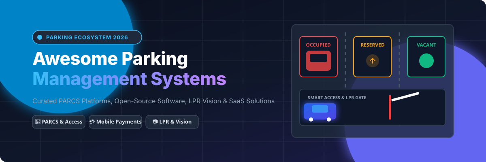

# 🚗 Awesome Parking Management 🅿️

  
  
  
  
  

  

## 📌 Top Parking Management Platforms Ecosystem

**Curated List of SaaS Platforms, PARCS Software & Open-Source GitHub Projects**

*Focused on Parking Access & Revenue Control Systems (PARCS), Mobile Payments, License Plate Recognition (LPR), Occupancy Detection, Smart Enforcement, Permit Management & Automated Parking Facilities.*

**Last updated: September 2026**

---

### 🌐 Ecosystem & Market Insights
The global **Parking Management Market size** is estimated at approximately **$4.5 Billion to $6.2 Billion**, projecting to surpass **$10 Billion by 2030** with a CAGR of ~11-12%. 

**Market Dynamics**: The sector is **highly fragmented** with regional PARCS hardware incumbents, city-specific mobile payment apps, and specialized software vendors. While consolidated global leaders (e.g., FLASH, Skidata, Flowbird) dominate airport, enterprise, and municipal parking infrastructures, it is **not a "winner-take-all" market**. Modular APIs, IoT integrations, and open computer-vision models are enabling rapid innovation for private operators and localized smart cities.

---

## 📑 Table of Contents

- [🏢 SaaS/Hosted Platforms](#-saashosted-platforms)
- [💻 Open-Source GitHub Projects](#-open-source-github-projects)
- [🤝 How to Contribute](#-how-to-contribute)
- [⚠️ Disclaimer](#%EF%B8%8F-disclaimer)
- [📊 Star History](#-star-history)

---

## 🏢 SaaS/Hosted Platforms

| Product | Company Size (Revenue / Valuation) | Description |
| :--- | :--- | :--- |
| **[FLASH (FlashParking)](https://www.flashparking.com/)** | ~$1.0B+ Valuation / ~$100M+ Revenue | Cloud-native parking platform for operators covering access, payments, enforcement, valet, and multi-location management. |
| **[Skidata](https://www.skidata.com/)** | ~$393M Revenue / €340M (~$369M) Acquisition | Enterprise access and parking management solutions used in large facilities, airports, and venues worldwide. |
| **[TIBA Parking](https://www.tibaparking.com/)** | ~$135M Acquisition / ~$60M Revenue | Parking access and revenue control systems with hardware and software for garages and lots. |
| **[Flowbird](https://www.flowbird.group/)** | ~$117M Revenue / Acquired by EasyPark Group | Global provider of parking solutions including pay stations, mobile payments, and back-office management (formerly Parkeon). |
| **[Passport Parking](https://passportinc.com/)** | ~$212M+ Funding / ~$21M Revenue | Comprehensive parking and mobility platform for cities and operators, including payments, enforcement, and digital permits. |
| **[Get My Parking](https://www.getmyparking.com/)** | ~$44M Valuation / ~$4M+ Revenue | Parking technology platform offering management, payments, and digital solutions for operators and cities. |
| **[ParkMobile](https://parkmobile.io/)** | ~$32.7M Revenue / Acquired by BMW Group | Leading mobile parking payments and operator platform widely used for meters, lots, airports, and venues. |
| **[ParkHub](https://parkhub.com/)** | ~$29.5M Revenue / Merged with JustPark | Parking and event operations platform focused on venues, occupancy, payments, and real-time management. |
| **[Parklio](https://parklio.com/)** | $1M–$10M Revenue (Est.) | Smart parking barriers and management solutions focused on reserved and private parking access control. |
| **[Parkalot](https://parkalot.io/)** | Bootstrap / Micro (Private) | Parking management solution aimed at simplifying reservations, access, and operations for various facility types. |

---

## 💻 Open-Source GitHub Projects

Below is a curated collection of open-source software, LPR engines, occupancy computer vision tools, and self-hosted parking frameworks, sorted by GitHub stargazers count:

- **[OpenALPR](https://github.com/openalpr/openalpr)**   
  Automated License Plate Recognition (ALPR / LPR) library written in C++ with bindings in Python, Node.js, and Java. Crucial engine for automated parking entry/exit gates.

- **[Ultralytics YOLO](https://github.com/ultralytics/ultralytics)**   
  Real-time computer vision models (YOLOv8 / YOLOv11) extensively used for vision-based parking space occupancy detection and vehicle tracking.

- **[parking_lot (Rust Primitives)](https://github.com/Amanieu/parking_lot)**   
  Compact and ultra-fast synchronization primitives (`Mutex`, `RwLock`) for high-performance concurrent parking systems and IoT sensor gateways.

- **[Awesome Parking Slot Detection](https://github.com/lymhust/awesome-parking-slot-detection)**   
  Curated list of deep learning research papers, datasets, and code implementations for automatic parking slot line detection.

- **[Parker](https://github.com/oxedom/parker)**   
  Browser-based parking detection and space monitoring application powered by TensorFlow.js and WebRTC.

- **[ParkingOS Cloud](https://github.com/ParkingOS/ParkingOS_cloud)**   
  Open-source parking cloud platform providing multi-level facility management, rate computation, data queries, and operational dashboards.

- **[ParkingSlot](https://github.com/visualbuffer/parkingslot)**   
  Python-based automated parking occupancy detection using deep learning models (Mask R-CNN and YOLO).

- **[Java Parking System](https://github.com/skyrunner360/Java-Parking-System)**   
  Relational DBMS-focused application for managing parking bays, operator shifts, fee calculation, and vehicle ticketing.

- **[Ezy-Parking](https://github.com/prathimacode-hub/Ezy-Parking)**   
  Smart parking allocation system combining IoT hardware, machine learning, and mobile booking capabilities.

- **[OsParking](https://github.com/osparking/OsParking_src)**   
  Open-source parking lot management software designed for registered vehicles, integrating LPR simulation and barrier relays.

---

### 💡 Frameworks for Building Custom Parking Architectures

Deploy camera-based occupancy detection (**YOLO / OpenALPR**) ➔ Manage permits and reservations in a self-hosted app ➔ Control access barriers via microcontrollers ➔ Process payments via external APIs (Stripe / PayPal) ➔ Report occupancy & revenue on open dashboards.

---

## 🤝 How to Contribute

1. Fork this repository.
2. Add/edit entries in `README.md` (maintain table & badge formatting).
3. Ensure entries include project name, link, star badge, and detailed description.
4. Submit a Pull Request with a clear summary.

⭐ **Star this repository if you find it useful!**

---

## ⚠️ Disclaimer

- This repository is a **community-curated** resource and does not constitute financial, legal, or commercial endorsement.
- Parking Access & Revenue Control Systems process vehicle registration data, financial payments, and barrier operations. Ensure strict PCI-DSS compliance, GDPR/privacy standards, and safety validation when deploying open-source or custom implementations.

---

## 📊 Star History

---

  <b>Made for parking operators, smart city planners, campuses, and software engineers building modern parking solutions.</b>

